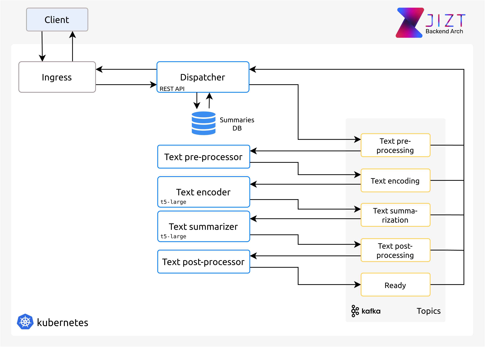
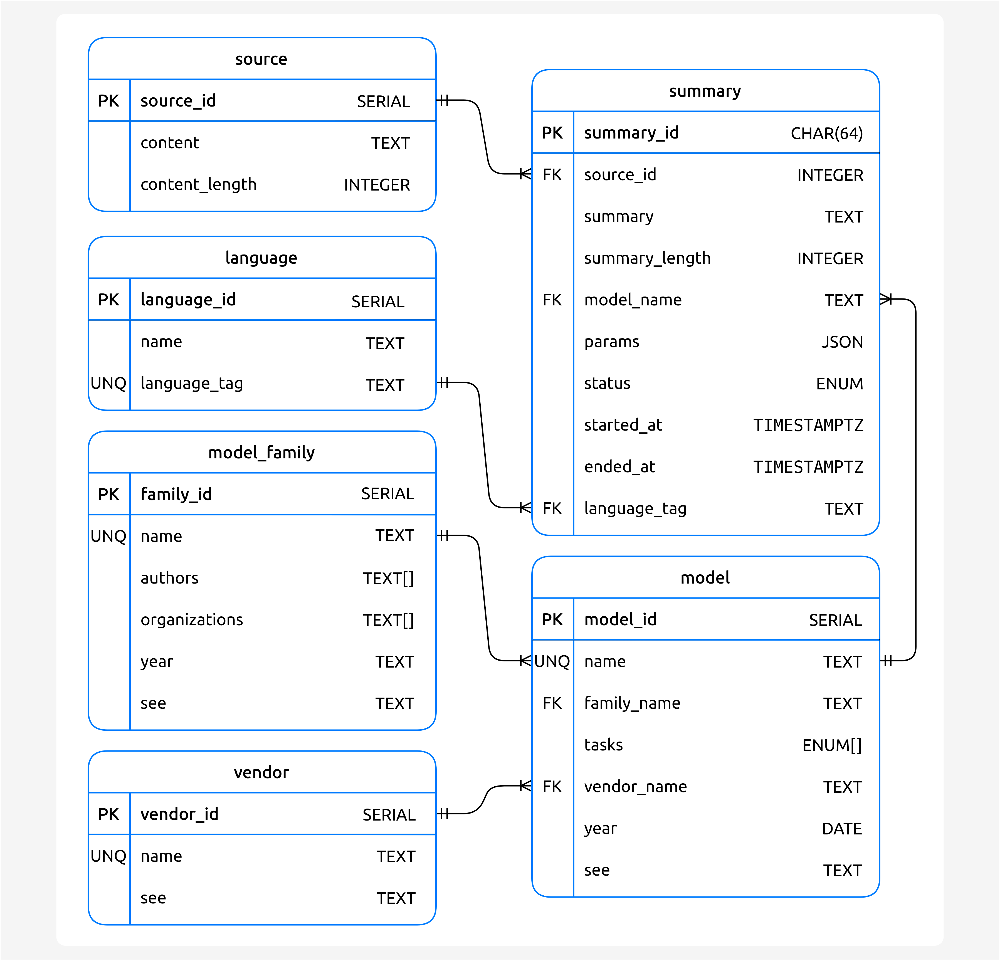

..
    Copyright (C) 2020-2021 Diego Miguel Lozano <contact@jizt.it>
    Permission is granted to copy, distribute and/or modify this document
    under the terms of the GNU Free Documentation License, Version 1.3
    or any later version published by the Free Software Foundation;
    with no Invariant Sections, no Front-Cover Texts, and no Back-Cover Texts.
    A copy of the license is included in the section entitled "GNU
    Free Documentation License".

.. _backend:architecture:

============
Architecture
============

The architecture of Jizt's backend has been conceived in a way that ensures
flexibility, scalability and high availability. For that, we have implemented a
microservice, event-driven architecture, so that each of the stages in the
summarization process is contained in a microservice. This way, we can scale each
microservice separately. This is useful, for example, in the case of the microservice
that implements the summarization stage, since this is the most time-consuming stage.
By scaling this microservice in particular, we are able to process more summaries in
parallel.

Below, we include an overview of the backend architecture:

   Overview of the backend architecture.

As can be seen in the previous image, we use `Kubernetes <https://kubernetes.io/>`__
to orchestrate the different microservices. In turn, `Apache Kafka
<https://kafka.apache.org/>`__ makes possible the communication between these
microservices. Specifically, we use `Strimzi <https://strimzi.io/>`__, which allows us
to easily deploy Kafka on Kubernetes. This (still small) architecture lets us add more
language models or other NLP tasks easily, by adding new microservices and their
corresponding Kafka topics. Since these models usually take a great deal of storage
space, they are stored in `Persistent Volumes
<https://kubernetes.io/docs/concepts/storage/persistent-volumes/>`_, which are then
accessed by the pods. Having this models included in the microservice's Docker image
would be both inefficient and inappropriate.

Apart from the summary-related microservices, the architecture also contains a
Dispatcher in charge of three tasks:

#. It implements a REST API so clients can request summaries. This REST API is
   implemented in Python with `Flask <https://flask.palletsprojects.com>`__ and the
   extension `Flask-RESTful <https://flask-restful.readthedocs.io>`__. If you want to
   know about its specification, you can refer to `docs.api.jizt.it
   <https://docs.api.jizt.it>`__.

#. It forwards the request to the appropriate microservice. For now, all the requests
   that Ingress forwards to the Dispatcher are as well redirected to the
   Pre-processor. However, in the future, requests to different models/NLP tasks will
   have to be forwarded to different microservices.

#. It stores the summaries in the database. The motivation behind this database is
   explained in the :ref:`next section <backend:rest_api>`. We implement a
   PostgreSQL database, deployed making use of the `Crunchy PostgreSQL Operator
   <https://access.crunchydata.com/documentation/postgres-operator>`__.

Regarding the database, its table schema is the following:

   Summaries database table schema.

The ``summary_id`` is produced by the Dispatcher, which hashes (SHA-256, 64 bits) the
source text, the summary parameters, and the model used to generate the summary.

Currently, the backend is hosted on `Google Kubernetes Engine
<https://cloud.google.com/kubernetes-engine>`__. The source code of Jizt backend is
accessible through `github.com/jizt-it/jizt-backend
<https://github.com/jizt-it/jizt-backend>`__.