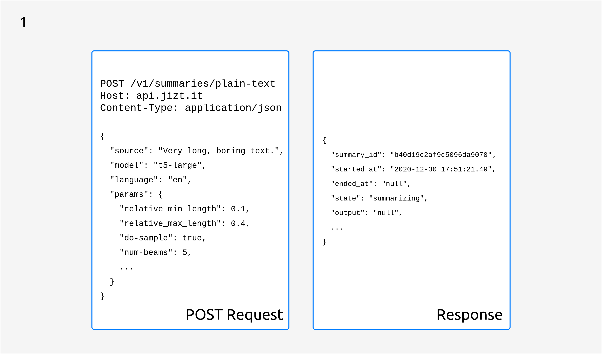

..
    Copyright (C) 2020-2021 Diego Miguel Lozano <contact@jizt.it>
    Permission is granted to copy, distribute and/or modify this document
    under the terms of the GNU Free Documentation License, Version 1.3
    or any later version published by the Free Software Foundation;
    with no Invariant Sections, no Front-Cover Texts, and no Back-Cover Texts.
    A copy of the license is included in the section entitled "GNU
    Free Documentation License".

.. _backend:rest_api:

========
REST API
========

The generation of summaries is a process that can take several seconds, depending on
the length of the text to be summarized, the parameters with which the summary is
generated or the service load at the moment. Because of that, it would not be
appropriate that summaries were requested with a single HTTP request, since it would
be too long-lived.

We handle this with asynchronous request processing, with which requesting a summary
is a two-step process.

HTTP POST request
-----------------

The client starts by making a POST request including the text to be summarized in the
body of the request. The API responds with a unique identifier of the summary, the
``summary_id``, as well as other information of interest.

   First, an HTTP POST request should be made. The API will then respond with the
   ``summary_id``.

As can be seen in the previous figure, the status of the summary is ``summarizing``,
and since the summary is not yet ready the ``output`` will be ``null``.

.. _sec:succesive-get-requests:

Successive HTTP GET requests
----------------------------

After the POST request, the client can perform consecutive HTTP GET requests with the
summary id periodically in order to query the status of the summary. At some point,
the status of the summary will change to ``completed``, and the response will
contain the generated summary, as illustrated in the following figure:

.. figure:: ../_static/images/backend/api-request-2.png
   :alt: HTTP GET request.
   :name: fig:api-request-2
   :align: center
   :width: 100%

   The summary will be included in ``output`` as soon as it is ready.

If a summary of the same text, with the same model and parameters had been previously
requested, the summary would already be stored in the database, so the response to the
first POST request would already contain the summary.

This is the main motivation behind implementing a database. Furthermore, apart from
working as a cache layer, the database is useful to keep some metrics, such as the
number of times a specific summary has been requested, or to evaluate the quality of
the generated summaries.

A more in-depth explanation
---------------------------

So what happens behind the scenes when a client requests a summary? The following
sequence diagram illustrates the process:

.. figure:: ../_static/images/backend/seq-diagram.png
   :alt: Jizt Backend sequence diagram.
   :name: fig:jizt-backend-seq-diagram
   :align: center
   :width: 100%

   Summary request and processing.

#. As we said, the client first makes an HTTP POST request, including in the body the
   text to be summarized, as well as parameters of the summary to be generated.

#. Ingress checks that the request is being made to a valid endpoint, and if so,
   redirects it to the Dispatcher.

#. The Dispatcher performs a series of checks:

   #. Queries the database to check if there is already a summary generated for that
      text with those parameters. If so, the client is answered with the summary data
      (``output``, ``source``, ``started_at``, ``ended_at``, etc.). The status of the
      summary in this case will be ``completed``.
   #. Otherwise, the same data schema is used, only the output will be ``null``, and
      the status will be ``summarizing``. At the same time, a message is sent to the
      preprocessor topic, containing the text and the summary parameters, starting
      thus the generation process.

#. The pre-processor is constantly checking if there are new messages in its topic. If
   there are, it consumes them, performs the pre-processing tasks, and produces the
   result to the encoder topic.

#. This process continues in the same way until it reaches the post-processor, which
   produces the final summary to the "ready" topic. The Dispatcher then consumes the
   message and updates the database with the generated summary.

#. While the summary process completes, the client performs GET requests periodically,
   until the REST API eventually responds with the generated summary.
