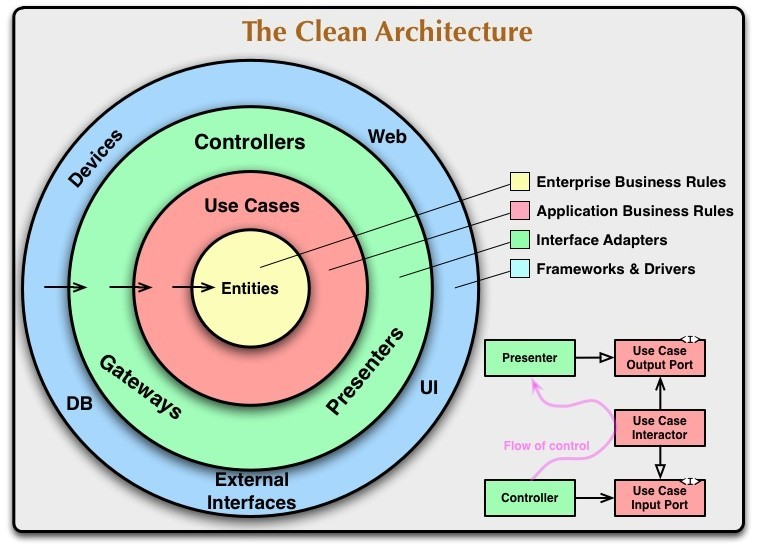
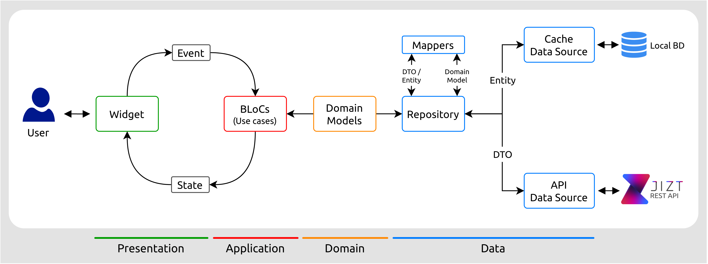
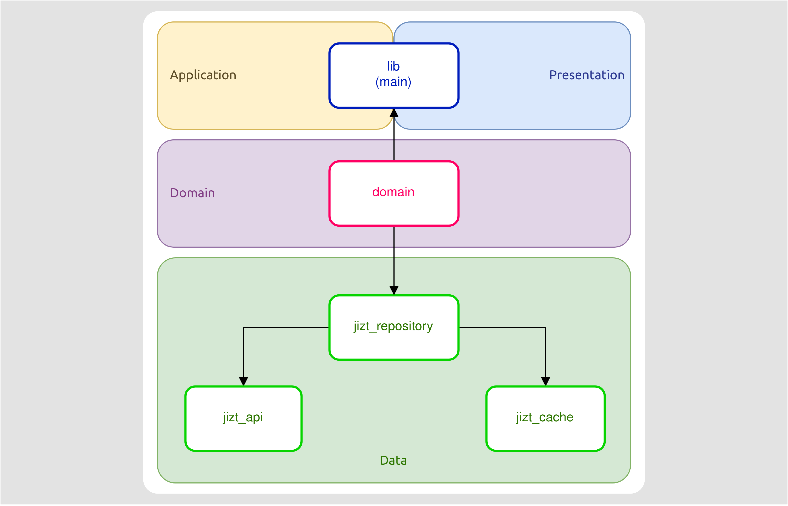
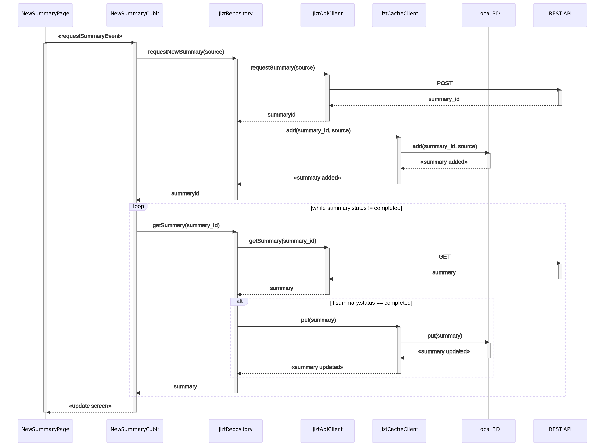

..
    Copyright (C) 2020-2021 Diego Miguel Lozano <contact@jizt.it>
    Permission is granted to copy, distribute and/or modify this document
    under the terms of the GNU Free Documentation License, Version 1.3
    or any later version published by the Free Software Foundation;
    with no Invariant Sections, no Front-Cover Texts, and no Back-Cover Texts.
    A copy of the license is included in the section entitled "GNU
    Free Documentation License".

.. _backend:cross-platform-app:

==================
Cross-platform app
==================

Jizt App is developed with Dart and Flutter, and thus it is cross-platform by default.
It implements a four-layer architecture and is mainly inspired by the Clean
Architecture and Domain-Driven Design (DDD) patterns. 

As a result, the fundamental principles of the developed architecture are:

-  Division of the application code into layers: each layer isolates an area of the
   code base.
-  Each layer is strict with its dependencies, being able to interact only with the
   lower layers.
-  As we move to the internal layers, the code becomes more generic. Thus, the upper
   layers dictate policies and rules, while the lower layers take care of
   implementation details such as databases, network operations or the user interface.
-  The structure and language of the code must be based on the business domain.

The following figure illustrates the Clean Architecture pattern, and can also be
applied to our architecture:

   Picture taken from `Uncle Bob's blog
   <https://blog.cleancoder.com/uncle-bob/2012/08/13/the-clean-architecture.html>`__.

These principles ensure that, even if the requirements, technologies or user interface
of the application change over time, the essential functionalities of the application
will not be significantly affected. In addition, this isolation between layers
provides us with greater scalability and testability of our code.

The following shows how the application architecture is conformed. As we can see, the
four layers mentioned in which our application is divided are: Presentation,
Application, Domain and Data.

   Jizt App architecture.

The different modules that conform the app correspond to the previous layers in the
following way:

   Jizt App modules.

When the user requests a new summary, this is what happens internally:

   Process followed when a user requests a new summary.

#. The user requests to generate a new summary by clicking on the screen.

#. The event is transformed through cubit into a summary request to the repository.

#. The repository makes an HTTP POST request to the backend to obtain the summary id
   from the source text, the summary parameters, and the model.

#. Once the summary id is obtained, the local database (cache layer) is queried to see
   if the requested summary is already available locally. If so, the summary is
   returned, and the screen is updated to show it to the user.

#. Otherwise, periodic GET requests are made to the REST API until the summary is
   complete, as we explained in the :ref:`previous section
   <sec:succesive-get-requests>`. Finally, the screen is updated.

The source code of Jizt App can be accessed at
`github.com/jizt-it/jizt-app <https://github.com/jizt-it/jizt-app>`__.
