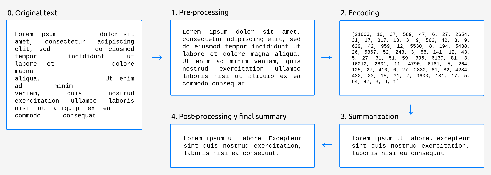

..
    Copyright (C) 2020-2021 Diego Miguel Lozano <contact@jizt.it>
    Permission is granted to copy, distribute and/or modify this document
    under the terms of the GNU Free Documentation License, Version 1.3
    or any later version published by the Free Software Foundation;
    with no Invariant Sections, no Front-Cover Texts, and no Back-Cover Texts.
    A copy of the license is included in the section entitled "GNU
    Free Documentation License".

.. _summarization_introduction:

============
Introduction
============

The generation of summaries is divided into four fundamental stages:

#. **Pre-processing**: in this stage, minor modifications are made to the input text
   to adapt it to the input expected by the language generation model.

#. **Encoding**: generation models do not "understand" natural language words as such.
   Therefore, it is necessary to convert the input text to numeric vectors, which
   is what the model can actually work with.

#. **Summarization**: in this stage is when the actual generation of the summary takes
   place. We currently use Google's `T5 model <https://arxiv.org/abs/1910.10683>`__
   implemented by `Hugging Face   
   <https://huggingface.co/transformers/model_doc/t5.html>`__.

#. **Post-processing**: the text produced by the model may contain small flaws. For
   example, some models are not cased, which means that they will most likely write
   all the words in lowercase. In this stage, we try to solve this kind of problems,
   in our case using a truecaser model, which is able to fix the text casing.

The following picture shows an overview of the different stages:

   Stages in the summarization process.